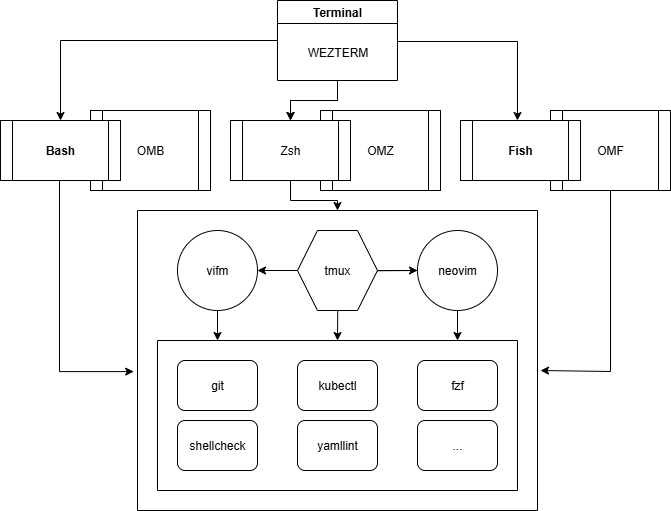

# Dotfiles

Dotfiles are hidden configuration files in Unix-like systems that store settings for shells, editors, and other tools. By managing our dotfiles, we'll ensure a consistent experience across systems and save time reconfiguring tools.

**All tools and configurations were tested under** `Linux Mint 22.1 Cinnamon`.

Download [install.sh](https://github.com/aalekseenkov/dotfiles/blob/master/.github/install.sh) into your newly home directory to install and test this configuration in some seconds:
- `wget https://github.com/aalekseenkov/dotfiles/raw/refs/heads/master/.github/install.sh`
- `chmod u+x install.sh`
- `bash install.sh`



## GNOME Terminal

### Gogh color's schemes

1. In GNOME Terminal *Preferences* rename `Unnamed` Profile's name to `Default`
2. Run pre-install and the Gogh script's commands
```
sudo apt update && sudo apt-get install -y dconf-cli uuid-runtime wget
bash -c "$(wget -qO- https://git.io/vQgMr)"
```
3. Input the numbers of the themes: Selenized Dark, Selenized Light (`280 281`)

## Monospaced fonts

### The collection of 31 [powerline fonts](https://github.com/powerline/fonts/blob/master/README.rst)

1. ```sudo apt update && sudo apt install -y git```
2. ```git clone https://github.com/powerline/fonts.git --depth=1```
3. ```cd fonts```
4. ```./install.sh```
5. ```cd ..```
6. ```rm -rf fonts```
7. In GNOME Terminal *Preferences > Selenized Light > Custom Font* - set `Hack` - 16
8. In GNOME Terminal *Preferences > Selenized Dark > Custom Font* - set `Hack` - 16
9. In GNOME Terminal *Preferences* > set `Selenized Light` as default theme

**To set the fonts that we can't see in the GNOME Terminal font's list (such as Fira):**

10. Open Menu > Font Selection
11. Set the system monospace font to `Fira Mono for Powerline Regular` - 16
12. In the Terminal's Font Preference, leave the Custom Font option unchecked, .i.e use system font

### Only Hack from [Nerd fonts](https://www.nerdfonts.com/)

1. ```sudo apt update && sudo apt-get install -y unzip curl```
2. ```sudo mkdir -p /usr/share/fonts/Hack```
3. ```curl -fsSLO $(curl -s https://api.github.com/repos/ryanoasis/nerd-fonts/releases/latest | grep browser_download_url | grep 'Hack.zip' | cut -d '"' -f 4)```
4. ```sudo unzip ./Hack.zip -d /usr/share/fonts/Hack/ && rm -f ./Hack.zip```
5. In GNOME Terminal *Preferences > Selenized Light > Custom Font* - set `Hack Nerd Font Mono` - 16
6. In GNOME Terminal *Preferences > Selenized Dark > Custom Font* - set `Hack Nerd Font Mono` - 16
7. In GNOME Terminal *Preferences* - set `Selenized Light` as default theme

## SysAdmin, DevOps and Developer Tools

1. ```sudo apt update```
2. ```sudo apt install -y git xclip tmux fzf zsh```
3. ```sudo apt install -y vim neovim```

## Dotfiles Installing

1. ```echo ".dotfiles" >> .gitignore```
2. ```git clone --bare https://github.com/aalekseenkov/dotfiles $HOME/.dotfiles```
3. ```alias dotfiles='/usr/bin/git --git-dir=$HOME/.dotfiles/ --work-tree=$HOME'```
4. ```dotfiles config --local status.showUntrackedFiles no```
5. ```mv .bashrc .bashrc.save```
6. ```dotfiles checkout```
7. ```source ~/.bashrc```
8. ```vim +PlugInstall +qall```
9. ```git clone https://github.com/tmux-plugins/tpm ~/.tmux/plugins/tpm```
10. ```~/.tmux/plugins/tpm/bin/install_plugins```

**You can change a shell for the current user to zsh:**

11. chsh -s /bin/zsh
12. shutdown -r now

## Additional actions (optional)

### Generating a new SSH key
1. ```ssh-keygen -t ed25519 -C "your_email@example.com"```
2. ```eval "$(ssh-agent -s)"```
3. ```ssh-add ~/.ssh/id_ed25519```

### Adding the SSH public keys to account on GitHub
We should add two ssh-keys (authentication one and signing one) to the account on GitHub

### Configuring Git for SSH commit signature verification
1. ```git config --global user.name "your_user"```
2. ```git config --global user.email "your_email@example.com"```
3. ```git config --global commit.gpgsign true```
4. ```git config --global gpg.format ssh```
5. ```git config --global user.signingkey "~/.ssh/id_ed25519.pub"```
6. ```git config --global gpg.ssh.allowedSignersFile ~/.ssh/allowed_signers```
7. ```touch ~/.ssh/allowed_signers```
8. ```echo "your_email@example.com <~/.ssh/id_ed25519.pub>" >> ~/.ssh/authorized_signatures```

### Switching remote URLs from HTTPS to SSH
1. ```git remote set-url origin git@github.com:OWNER/REPOSITORY.git```
2. ```git remote -v```

## Articles

* [The best way to store your dotfiles: A bare Git repository EXPLAINED](https://www.ackama.com/what-we-think/the-best-way-to-store-your-dotfiles-a-bare-git-repository-explained/)
* [Manage Dotfiles With a Bare Git Repository](https://harfangk.github.io/2016/09/18/manage-dotfiles-with-a-git-bare-repository.html)
* [Dotfiles: Best way to store in a bare git repository](https://www.atlassian.com/git/tutorials/dotfiles)

## Storing using a bare repository (initial step):

1. ```git init --bare $HOME/.dotfiles```
2. ```alias dotfiles='/usr/bin/git --git-dir=$HOME/.dotfiles/ --work-tree=$HOME'```
3. ```echo "alias dotfiles='/usr/bin/git --git-dir=$HOME/.dotfiles/ --work-tree=$HOME'" >> $HOME/.bashrc```
4. ```dotfiles config --local status.showUntrackedFiles no```
5. ```dotfiles add .vimrc```
6. ```dotfiles commit -S -m "add .vimrc"```
7. ```dotfiles remote add origin git@github.com:aalekseenkov/dotfiles.git```
8. ```dotfiles push -u origin master```
